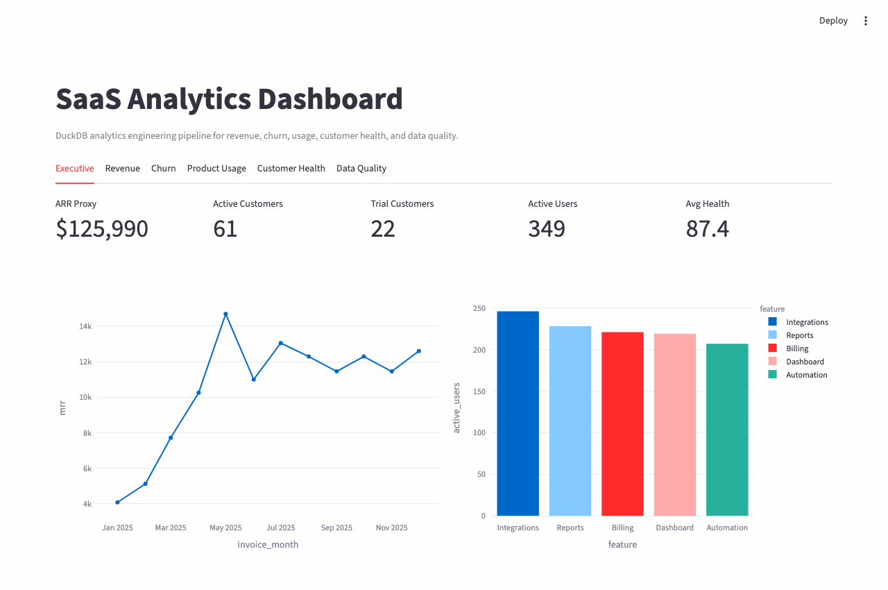
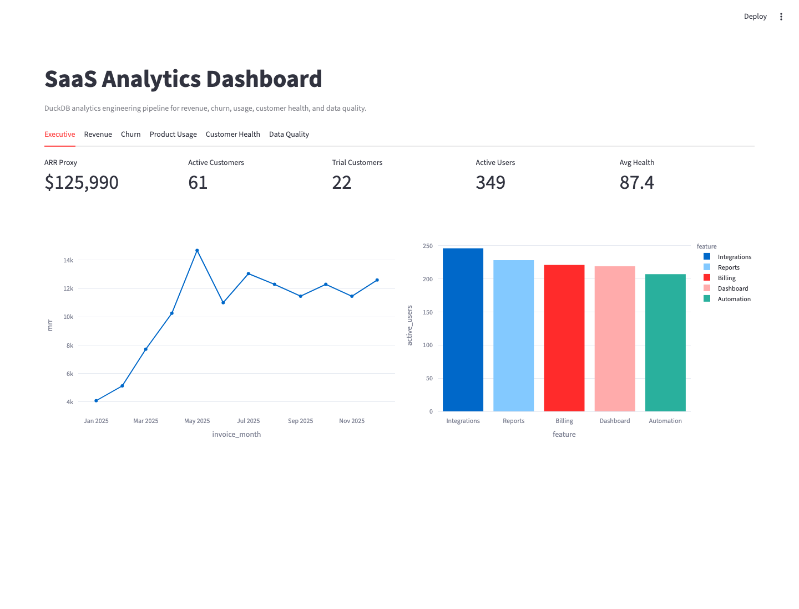
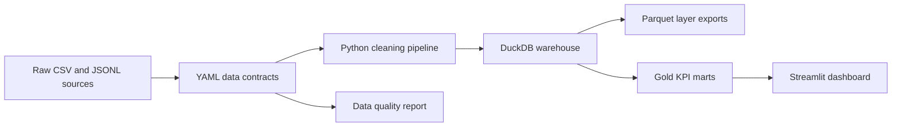
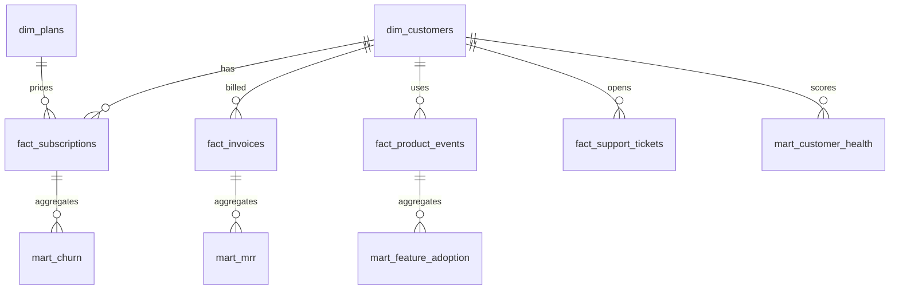

# SaaS Analytics Engineering Pipeline

[](https://github.com/AhmedYasserShalaby/saas-analytics-engineering-pipeline/actions/workflows/tests.yml)

SaaS analytics engineering portfolio project that turns customer, billing, subscription, support, and product-event data into DuckDB/Parquet layers, trusted KPI marts, and a Streamlit dashboard.

## Live Demo

Streamlit Cloud URL: https://ahmed-saas-analytics-pipeline.streamlit.app/

The dashboard bootstraps demo data automatically if generated exports are missing.





## Architecture



## Metrics

- Monthly recurring revenue
- Active customers
- Trial customers
- Churned customers
- Active users
- Feature adoption
- Customer health score
- Data quality score

## Warehouse Model



## Local Run

```bash
python3 -m venv .venv
source .venv/bin/activate
pip install -e ".[dev]"
saas-analytics generate-data
saas-analytics run-pipeline --mode full
streamlit run app/streamlit_dashboard.py
```

## Docker

```bash
docker compose up dashboard
docker compose run --rm pipeline saas-analytics run-pipeline --mode full
```

## Testing

```bash
ruff check .
ruff format --check .
pytest --cov=src/saas_analytics --cov-report=term-missing
```

## Docs

- [Architecture](docs/architecture.md)
- [Data model](docs/data_model.md)
- [KPI definitions](docs/kpi_definitions.md)
- [Data contracts](docs/data_contracts.md)

## Project Summary

- Built a SaaS analytics engineering pipeline that ingests customer, billing, subscription, support, and product-event data into DuckDB/Parquet layers and exports trusted KPI marts.
- Modeled MRR, churn, trial conversion, product adoption, and customer health metrics with SQL transformations, data contracts, incremental loading, and automated quality checks.
- Delivered a Streamlit executive dashboard with CI tests, Docker support, documentation, and reproducible local/demo setup.
