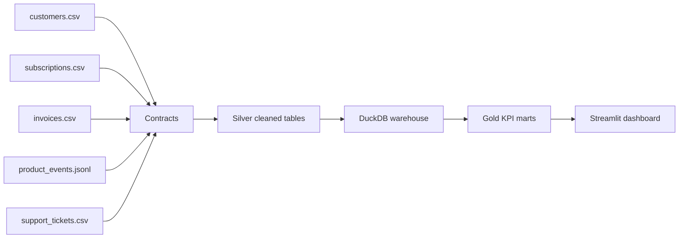

# Architecture

The project follows a small analytics-engineering warehouse pattern.

```mermaid
flowchart LR
    A[customers.csv] --> B[Contracts]
    C[subscriptions.csv] --> B
    D[invoices.csv] --> B
    E[product_events.jsonl] --> B
    F[support_tickets.csv] --> B
    B --> G[Silver cleaned tables]
    G --> H[DuckDB warehouse]
    H --> I[Gold KPI marts]
    I --> J[Streamlit dashboard]
```

DuckDB is used because it is local, SQL-friendly, analytical, and easy to publish as a portfolio project.
