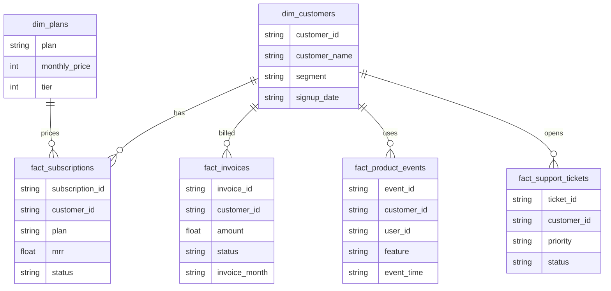

# Data Model

## Silver Tables

- `dim_customers`
- `dim_plans`
- `fact_subscriptions`
- `fact_invoices`
- `fact_product_events`
- `fact_support_tickets`

## Gold Marts

- `mart_mrr`
- `mart_churn`
- `mart_feature_adoption`
- `mart_customer_health`
- `executive_overview`

The model separates raw source files, cleaned warehouse tables, and KPI marts.

## ERD

